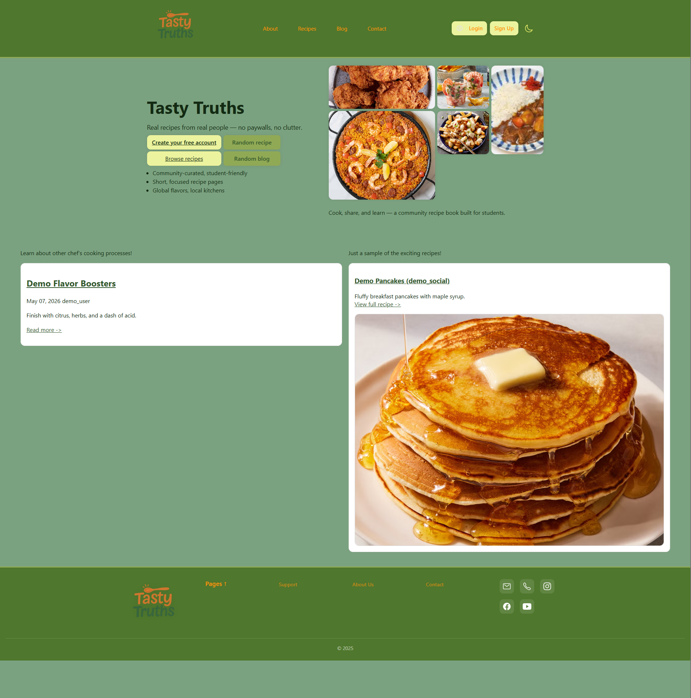
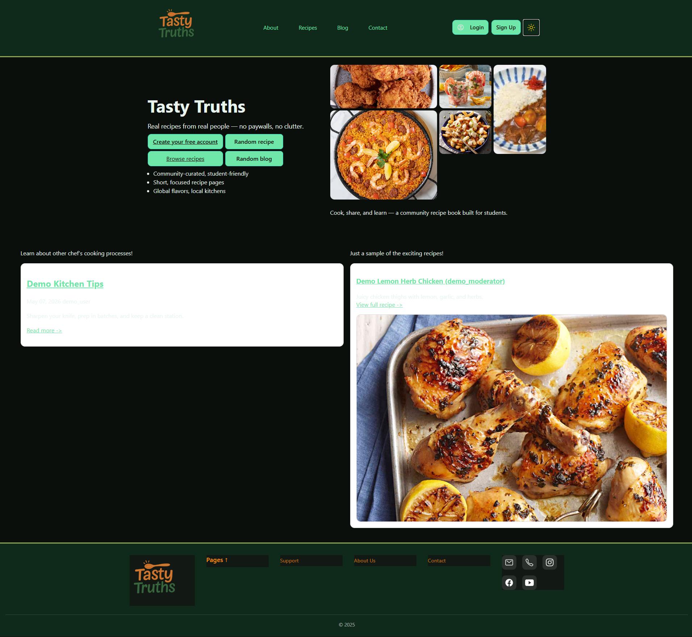
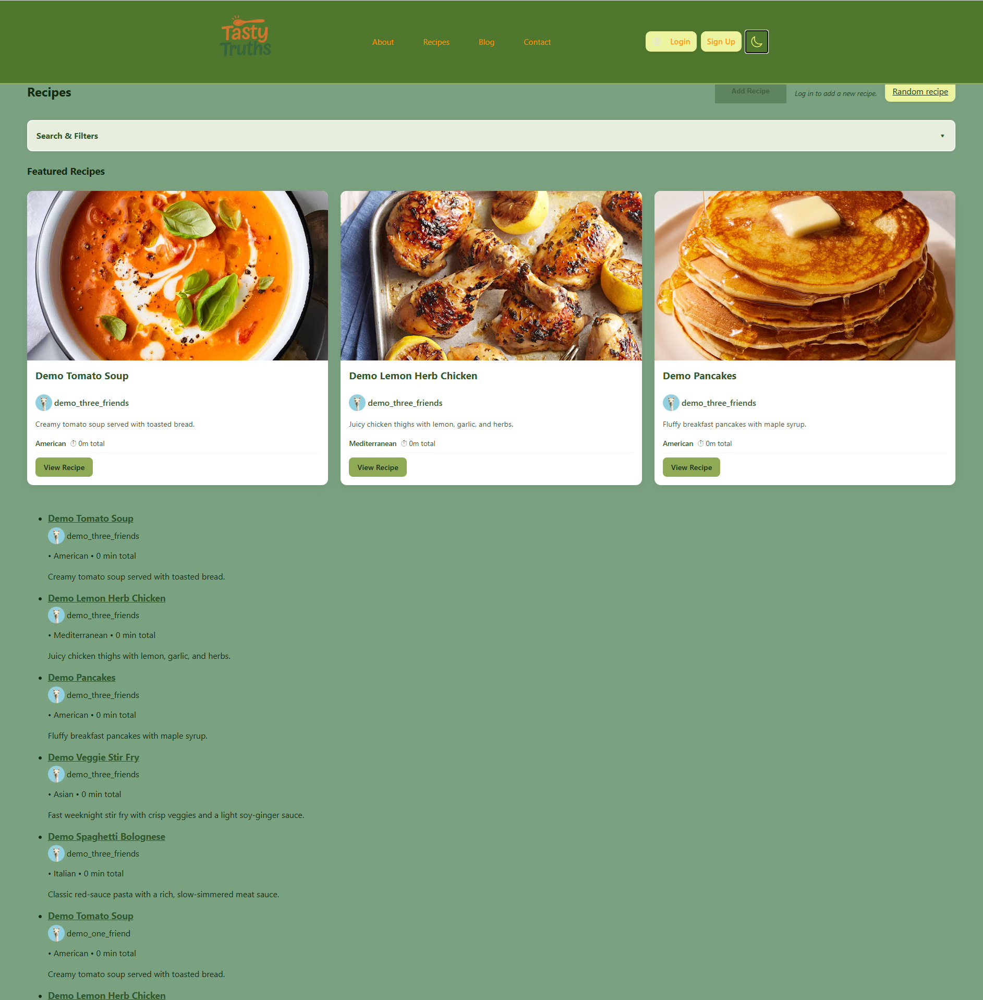
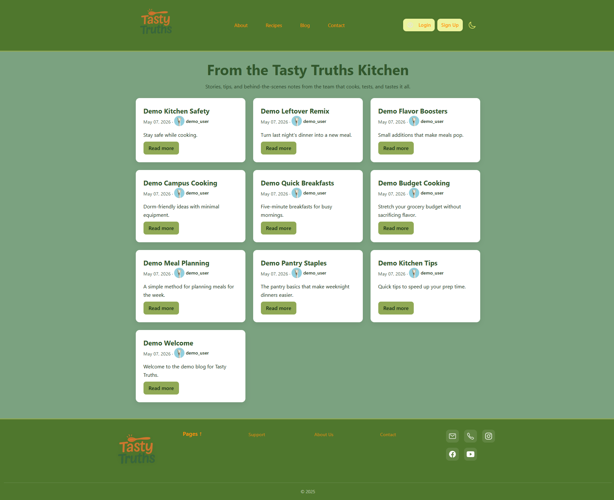
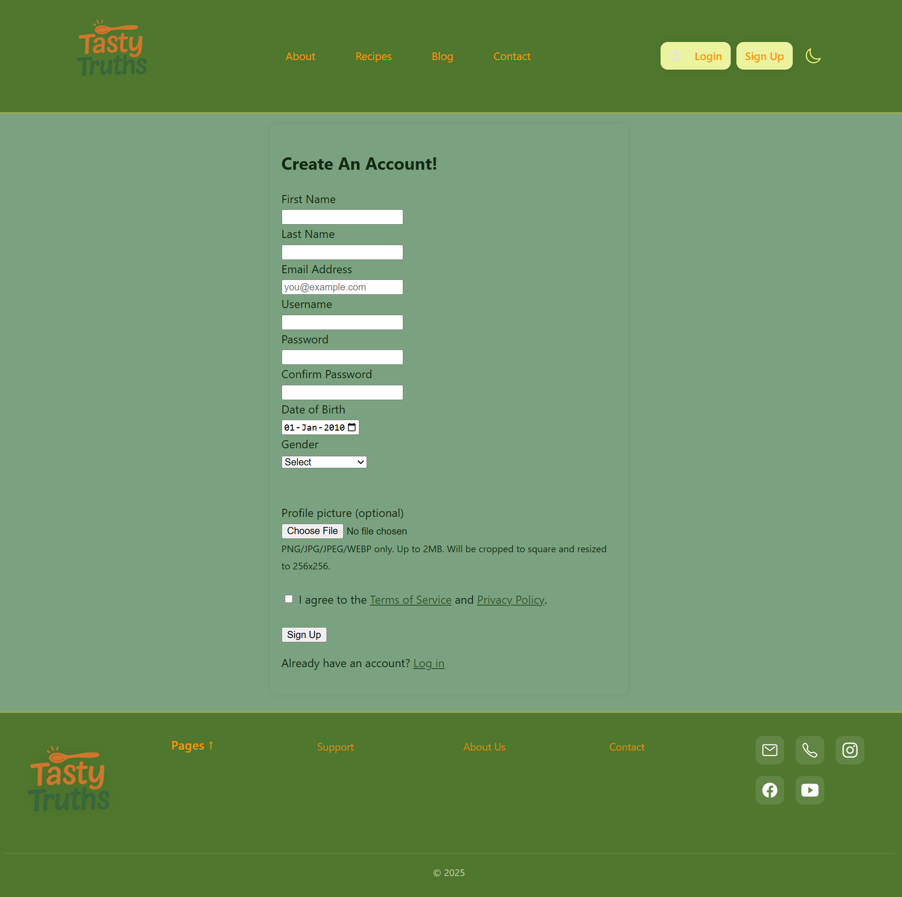
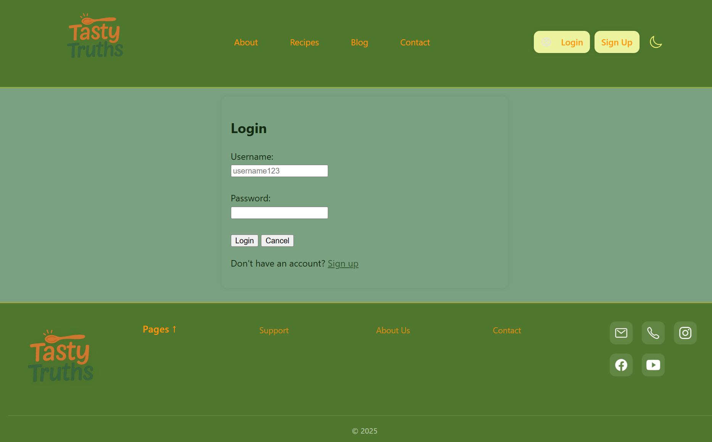
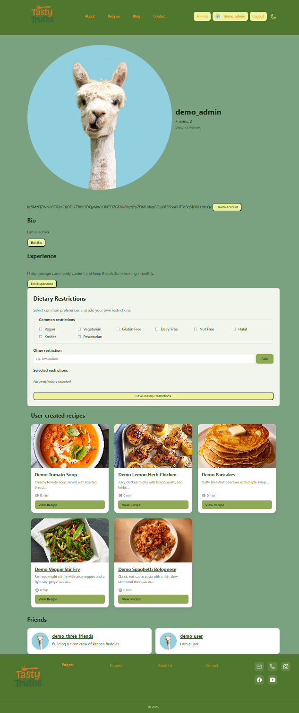
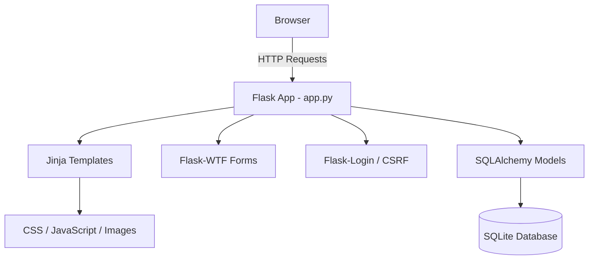

# Tasty Truths

Tasty Truths is a Flask-based full-stack recipe sharing and social cooking platform developed by a university student team. The project combines server-rendered Jinja templates, SQLAlchemy models, authentication, role-based user management, recipe publishing, blog functionality, and social profile features into a collaborative web application.

## Overview

Tasty Truths was built as an educational team project to explore how a real web application is structured beyond static pages. The project focuses on practical full-stack engineering skills: routing, templates, form validation, authentication, database modeling, migrations, file uploads, tests, and maintainable documentation.

The product idea is a student-friendly recipe community where users can browse recipes, create their own recipes, maintain a cooking profile, read community blog posts, and connect with other users.

## Screenshots

**Landing page**



**Landing page with dark mode**



**Recipe page**



**Blog page**



**Sign up page**



**Login page**



**Profile page**



## Implemented Features

- Flask application factory in `app.py` with server-rendered routes and JSON API endpoints.
- Jinja template views for the home page, recipes, recipe detail pages, recipe creation, blog pages, authentication, public profiles, profile editing, friends, contact, and about pages.
- User signup and login with Flask-Login sessions.
- Password hashing with Argon2.
- Flask-WTF forms with CSRF protection for recipe creation, signup profile picture upload, blog posts, and profile editing.
- Recipe browsing through `/recipes`, including featured recipe cards and recipe detail pages.
- Authenticated recipe creation through `/recipes/create`.
- Recipe image uploads stored under `static/uploads/recipes/`.
- Recipe deletion for recipe owners, moderators, and admins.
- Slug generation for recipes and blog posts.
- Recipe slug history redirects for renamed recipes.
- Blog listing, blog detail pages, authenticated blog creation, author/staff edit flow, and delete flow.
- Public user profiles at `/profile/<username>`.
- Logged-in profile page at `/profile_page`.
- Profile editing for bio, experience, dietary restrictions, and profile images.
- Role-based user model with `normal`, `moderator`, and `admin` roles.
- Staff moderation behavior for selected content actions.
- Admin-only user deletion route.
- Friendship features, including add/remove friend routes, friends page, profile friend counts, and relationship summaries.
- Friend request API endpoints for request/respond workflows.
- Ingredient suggestion and ingredient list APIs.
- Nutrition helper utilities and tests for macro calculation from ingredient data.
- Demo data seeding through a Flask CLI command.
- Pytest coverage for auth/profile behavior, roles, recipes, friendships, ingredient filtering, nutrition, and seed data.
- Documentation files including `architecture.md`, `SYSTEM_MANUAL.md`, `USER_GUIDE.md`, and recipe screening notes.

## Key Engineering Areas

- Full-stack Flask web development
- Authentication and role-based access control
- SQLAlchemy ORM and database migrations
- Server-rendered Jinja architecture
- File uploads and media handling
- Testing with Pytest
- Social/user relationship systems
- Documentation and maintainability

## Tech Stack

**Backend**

- Python
- Flask
- Flask-Login
- Flask-WTF / WTForms
- Flask-SQLAlchemy
- Flask-Migrate / Alembic
- SQLAlchemy
- Argon2 password hashing

**Frontend**

- Jinja templates
- HTML
- CSS
- JavaScript

**Database and Storage**

- SQLite development database at `instance/site.db`
- SQLAlchemy ORM models
- Alembic migration files under `migrations/`
- Local static file uploads for recipe images and profile pictures

**Testing and Tooling**

- Pytest
- Flask test client
- Git / GitHub-compatible repository structure

## Architecture

Tasty Truths is structured as a server-rendered Flask application. The main entry point is `app.py`, which defines the app factory, initializes extensions, registers routes, handles authentication/session behavior, and exposes CLI helpers such as demo seeding.

The frontend is primarily rendered through Jinja templates in `templates/`, with shared layout, navigation, flash messaging, and page-specific views for recipes, blog posts, authentication, profiles, and friends. Static assets live under `static/`, including CSS, images, uploads, and lightweight JavaScript helpers such as the global dark-mode/fetch helper script.

The data layer uses SQLAlchemy models in `services/models.py`, backed by a local SQLite database for development. Flask-Login manages user sessions, Flask-WTF and CSRF protection secure form workflows, and Flask-Migrate/Alembic provides database migration support under `migrations/`.



For a deeper route and module map, see `architecture.md`.

## Project Structure

```text
.
├── app.py                    # Flask app factory, route definitions, auth, APIs, CLI commands
├── services/
│   ├── db.py                 # SQLAlchemy extension instance
│   ├── models.py             # User, Recipe, BlogPost, Ingredient, Friendship, FriendRequest models
│   ├── forms.py              # Flask-WTF forms for recipes, blogs, signup, and profile editing
│   ├── friendships.py        # Friendship and friend request domain logic
│   ├── ingredients.py        # Ingredient sorting helpers
│   ├── ingredient_index.py   # Ingredient search and matching helpers
│   ├── filtering.py          # Dietary tag filtering
│   └── nutrition.py          # Nutrition calculation helpers
├── utilities/
│   ├── seed_demo.py          # Demo users, recipes, blogs, friendships, and friend requests
│   ├── slug.py               # Slug generation utilities
│   ├── images.py             # Profile image upload processing
│   └── nutrition.py          # Additional nutrition utilities
├── templates/                # Jinja templates and shared partials
├── static/
│   ├── css/                  # Application styles
│   ├── js/                   # Browser-side JavaScript helpers
│   ├── assets/               # Images, ingredient data, favicon files, policy PDFs
│   └── uploads/              # Local profile picture and recipe upload folders
├── migrations/               # Flask-Migrate / Alembic configuration and revisions
├── tests/                    # Pytest test suite
├── docs/screenshots/         # Existing application screenshots
├── architecture.md           # Detailed route/module architecture notes
├── SYSTEM_MANUAL.md          # Operational documentation
├── USER_GUIDE.md             # End-user guide
├── instructions.txt          # Original local run notes, now incorporated below
└── requirements.txt          # Python dependencies
```

The application is currently organized as a single Flask app in `app.py` rather than separate blueprints. Data access is handled through SQLAlchemy models in `services/models.py`, while templates in `templates/` render most user-facing pages through Jinja.

## Security and User Management

- Flask-Login manages authenticated user sessions.
- Passwords are stored as Argon2 hashes through `argon2-cffi`.
- Flask-WTF and `CSRFProtect` provide CSRF protection for standard form flows.
- Session cookies are configured as HTTP-only with `SameSite=Lax`.
- File uploads are restricted by extension and size limits.
- Profile picture processing uses Pillow helpers and validates image dimensions.
- Users have one of three roles: `normal`, `moderator`, or `admin`.
- Staff users can perform selected moderation actions, such as editing/deleting blog posts and deleting recipes.
- Admin users can access an account deletion route.
- A development-only admin override mode exists for local testing and should not be enabled in production.

## Database / Migrations

The app uses SQLite for local development:

```text
sqlite:///site.db
```

With Flask's instance-folder behavior, the local database is created at:

```text
instance/site.db
```

Primary SQLAlchemy models include:

- `User`
- `Recipe`
- `BlogPost`
- `RecipeSlugHistory`
- `Ingredient`
- `DietaryTag`
- `Friendship`
- `FriendRequest`

Alembic migration files are stored in `migrations/versions/`. The current repository includes migrations for friendship tables and canonical friendship storage.

Apply migrations with:

```bash
flask --app app db upgrade
```

Note: `create_app()` currently calls `db.create_all()` during startup, which is convenient for local development but can hide migration drift. For production-style workflows, prefer reviewing and applying Alembic migrations explicitly.

## Testing

The project includes a pytest suite under `tests/`.

Run the full test suite:

```bash
pytest
```

The tests cover areas including:

- Recipe creation and validation
- Recipe image upload behavior
- Signup and profile picture handling
- Public and private profile pages
- Profile editing
- Dietary restrictions
- Role-based permissions
- Friendship model and route behavior
- Friend request/demo seed behavior
- Ingredient search, filtering, and sorting
- Nutrition calculations
- Admin override behavior

## Quick Start

### 1. Create and activate a virtual environment

macOS / Linux:

```bash
python3 -m venv .venv
source .venv/bin/activate
```

Windows PowerShell:

```powershell
python -m venv .venv
.\.venv\Scripts\Activate.ps1
```

Windows Command Prompt:

```bat
python -m venv .venv
.venv\Scripts\activate
```

### 2. Install dependencies

```bash
pip install -r requirements.txt
```

### 3. Apply migrations

```bash
flask --app app db upgrade
```

### 4. Seed demo data

For a clean demo database, remove the local SQLite file first:

macOS / Linux:

```bash
rm instance/site.db
flask --app app seed-demo
```

Windows PowerShell:

```powershell
Remove-Item instance/site.db -ErrorAction SilentlyContinue
flask --app app seed-demo
```

### 5. Run the application

```bash
python app.py
```

The development server runs on:

```text
http://localhost:5500
```

## Demo Accounts / Sample Usage

After running:

```bash
flask --app app seed-demo
```

the following demo accounts are available:

| Role | Username | Password |
| --- | --- | --- |
| Admin | `demo_admin` | `demo-admin` |
| Moderator | `demo_moderator` | `demo-moderator` |
| Standard user | `demo_user` | `demo-user` |
| Social demo user | `demo_social` | `demo-social` |
| User with one friend | `demo_one_friend` | `demo-one` |
| User with three friends | `demo_three_friends` | `demo-three` |

Example manual test flow:

1. Log in as `demo_user`.
2. Open `/recipes` to browse seeded recipes.
3. Create a recipe from `/recipes/create`.
4. Open `/profile_page` to edit profile fields.
5. Visit another user's public profile and add or remove them as a friend.
6. Log in as `demo_moderator` or `demo_admin` to test staff-only content actions.

## Known Limitations

- The app is designed for local educational development, not production deployment.
- The default `SECRET_KEY` is a placeholder and must be replaced for any deployed environment.
- SQLite is used as the development database.
- `SESSION_COOKIE_SECURE` is disabled for local HTTP development.
- `create_app()` currently calls `db.create_all()`, so database initialization is not fully migration-driven.
- The visible friend UI supports add/remove behavior, while the friend request API exists separately and is not fully surfaced everywhere in the Jinja UI.
- Recipe editing is not currently implemented, although recipe deletion is available for owners and staff users.
- Likes, comments, follows, reposts, and ratings are not implemented as user-facing features.
- Some JavaScript files and legacy helper modules are present but are not wired into the active Jinja-rendered pages.
- The app stores uploaded files locally under `static/uploads/`, so it does not include cloud storage or CDN integration.
- Alembic history should be reviewed before production use because the visible migration chain references earlier revisions that are not all present in this repository snapshot.

## Future Improvements

- Add recipe editing with permission checks for owners and staff.
- Complete a unified friend request UI around the existing friend request API.
- Add comments, likes, ratings, and saved recipes.
- Add richer recipe search and filtering using cuisine, dietary tags, prep time, and ingredient metadata.
- Expand nutrition display on recipe pages using the existing nutrition helper functions.
- Split the large `app.py` route file into Flask blueprints for maintainability.
- Move secrets and environment-specific settings into environment variables or instance config.
- Replace local upload storage with production-ready object storage.
- Improve migration history and remove reliance on `db.create_all()` for schema changes.
- Prune or integrate legacy JavaScript and prototype modules.
- Add CI automation for tests, linting, and migration checks.

## Team / Coursework Context

Tasty Truths is an educational team project developed as part of university coursework. The project was built to practice collaborative software development, full-stack Flask engineering, database-backed web application design, authentication, role-based behavior, testing, and project documentation.

The student team context is intentionally preserved: the goal is not only to ship a working recipe community prototype, but also to demonstrate maintainable engineering practices and growth across backend, frontend, database, security, and testing responsibilities.

## Lessons Learned
- Designing maintainable SQLAlchemy model relationships
- Managing schema evolution with Alembic migrations
- Balancing server-rendered templates with lightweight JavaScript
- Implementing authentication and role-based permissions securely
- Coordinating collaborative development in a shared codebase