# Welcome to the Tasty Truths User Guide!

## Overview

Does your browser look like this?

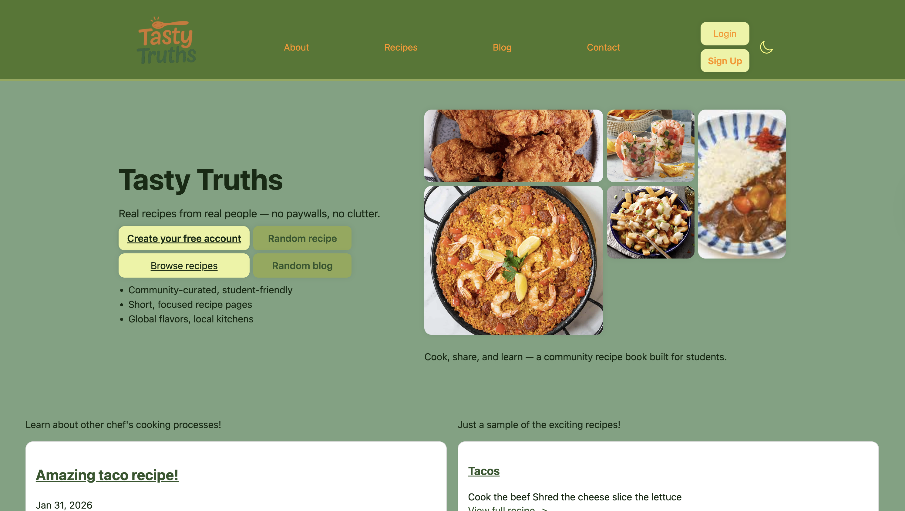

Then welcome to the user guide for **Tasty Truths**. This guide is meant as an introduction for new users on the Tasty Truths website! This website is a community built by students who love to cook, for other cooks who want to share their recipes with the world. We are an easy-to-manage website that will have you sharing and exploring recipes in no time.

Unlike many other sites, we have no paywalls and no ads — just good recipes and good food. The goal is to welcome new cooks, experienced cooks, and anyone trying to make a new meal.

Tasty Truths believes that food is universal, and access to learning different meals should be too. Now let’s get you started and connected with the world of cooking!

## Getting Started

Lets get started! So you are currently on our homepage.  Lets navigate to the login page. Once there it should look like this: 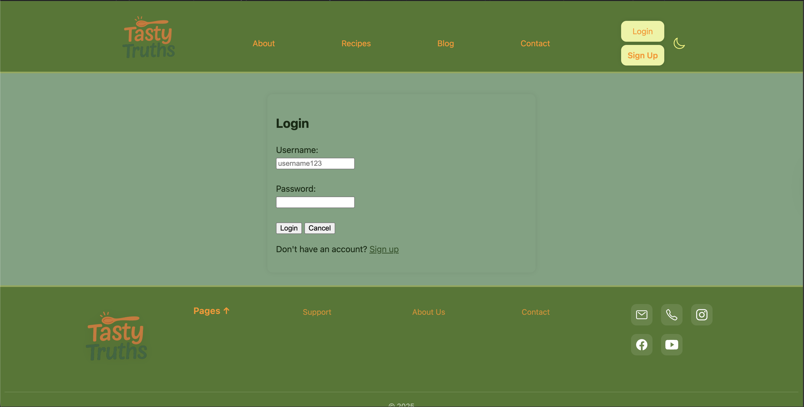 Now lets click the sign up, it should look like this: 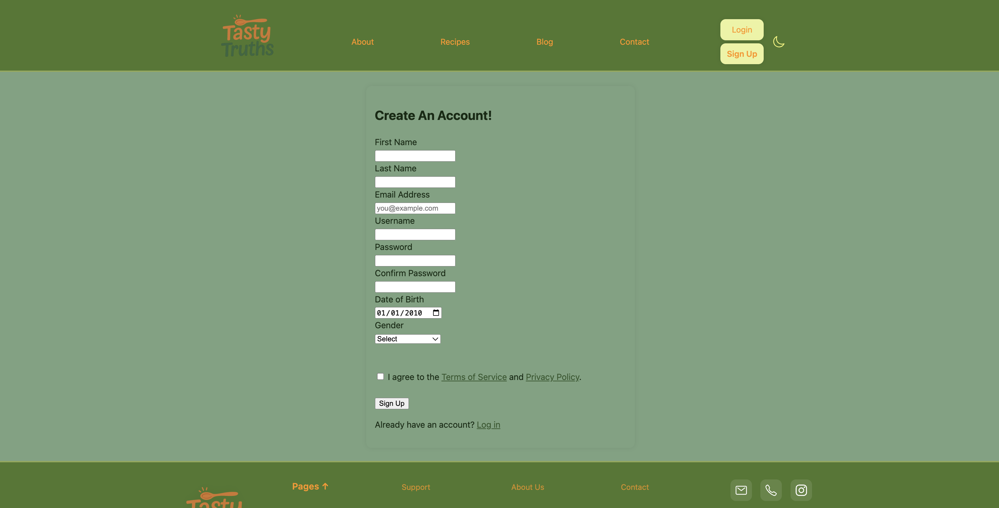 This is where you can create your Tasty Truths account. Once logged in your header should look like this:  Heads up! If you click your profile you will be taken to the profile home page which looks like this: 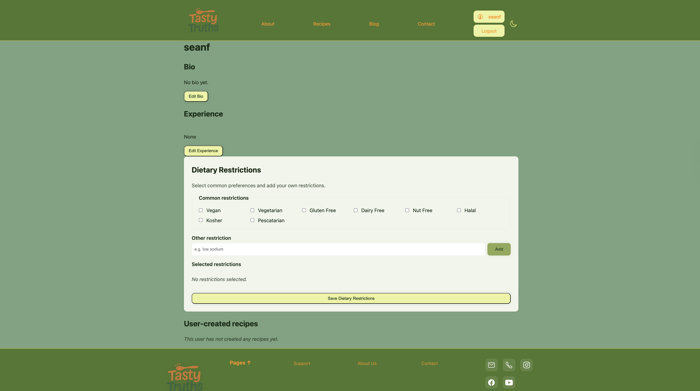From here we are going to navigate to the About Us Page. It should look like this: 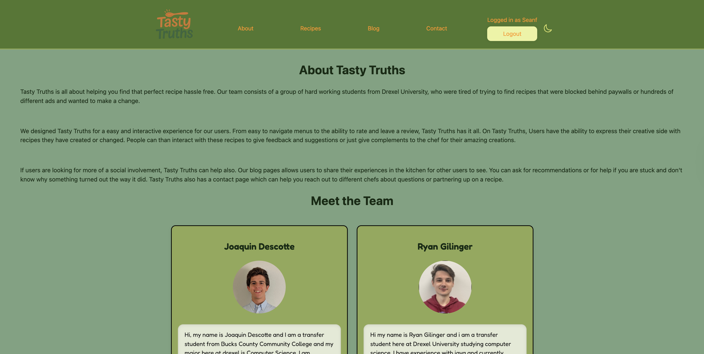 This page has all the information about the founders of Tasty Truths. From here we are going to go to our contact page. It should look like this: 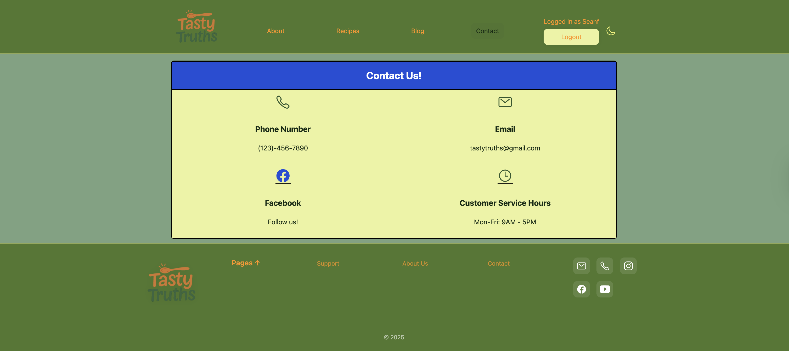 This page contains all forms of contact for Tasty Truths. Next lets go to the blog page, which will look like this: 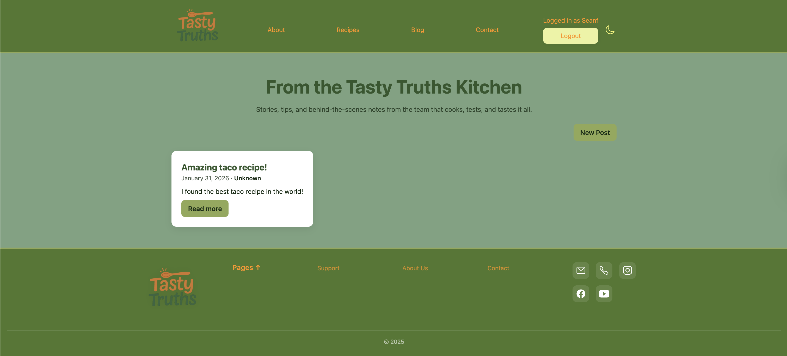 This page is where users can post blogs about a recipe or any general thoughts they have. Next is the recipe page which looks like this: 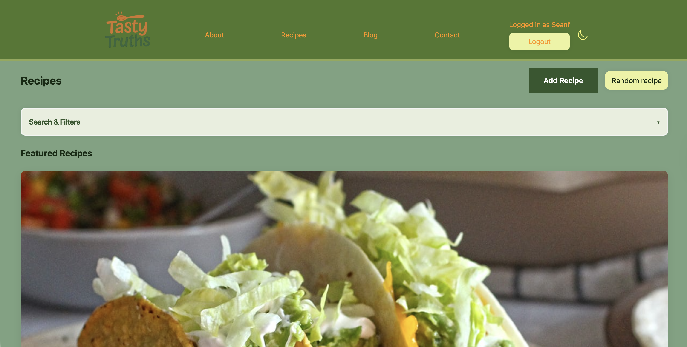 This is the heart of our site this is where you can explore and upload recipes. Finally here is a photo of our footer: 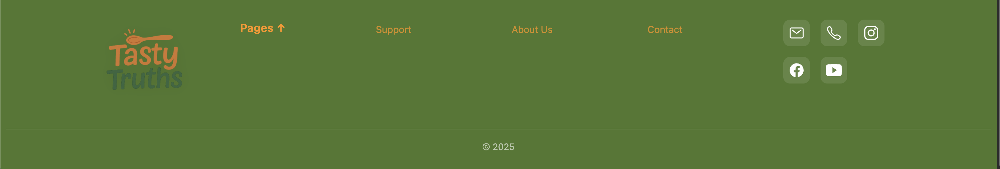 This is the same on every page, this contains link to all the mentioned pages, and some social links.

## Core Features & Examples

Welcome this section we are going to explain our core features which are: Login, Dark Mode, Create a Blog, and Recipe Guides
### Login In/Sign Up
    Navigate the the login page. If you have an account you may login, if not click the sign up button.

    Once at the sign up page, fill out the form, and you will be redirrected to the login page, where you may now login.

### Profile Editing
    Navigate to the profile page. Once on the profile page, you will see a default photo which you can change, a bio you can add up to 255 characters, an experience tab, and a dietary restrictions. At the bottom you will also see all the recipes you have created.
    Intially on the page:

    
    After Clicking Edit, you know have the ability to edit these features, once clicking save it will save on your profile.
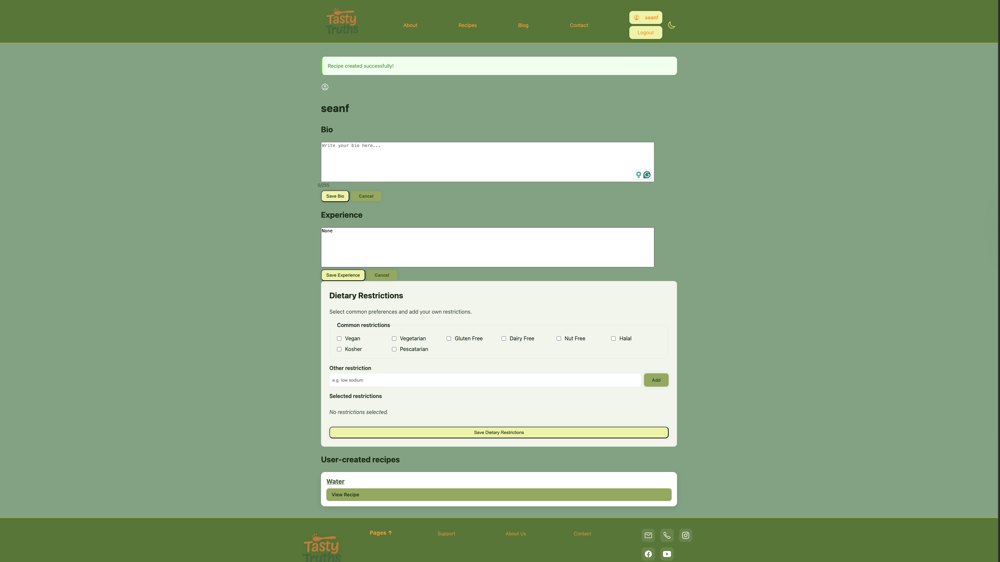

### Dark Mode
    If you click the moon or the sun next to login in your page will enable dark mode and look like below
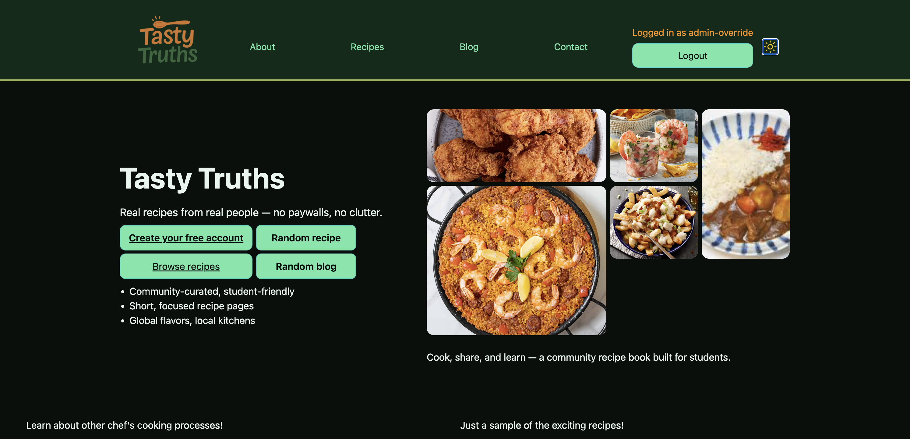

### Blog Features
    Navigate to the Blog Page

    If Logged in you can click the new post button. And you will see the image below.
    This allows you to add title, summary, and content. Once you click post it will appear on the blog page.
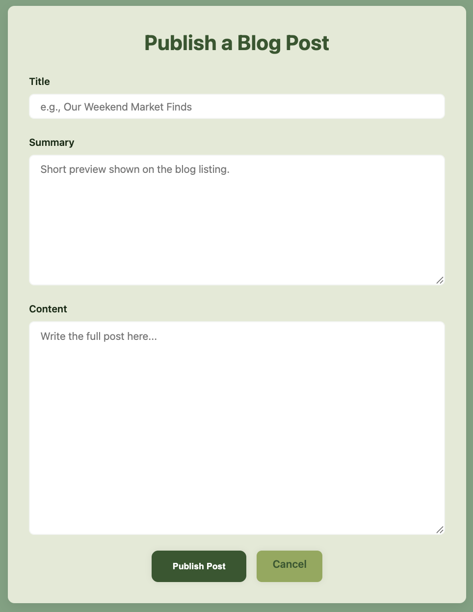

    

### Recipe Features
    Navigate to the Recipe Page

    If logged in you can click the add button which will open the window below.
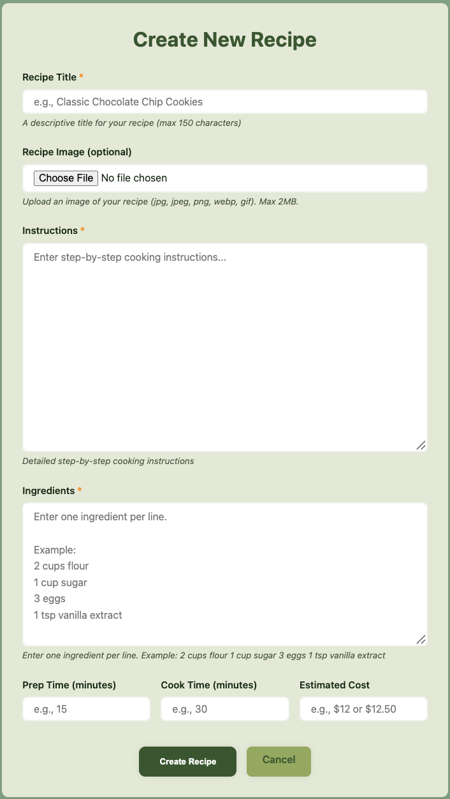

    This sections allows you to add a title, a photo, instructions, ingredients, prep time, cook time, and estimate cost. Once posted you will have an image like below.
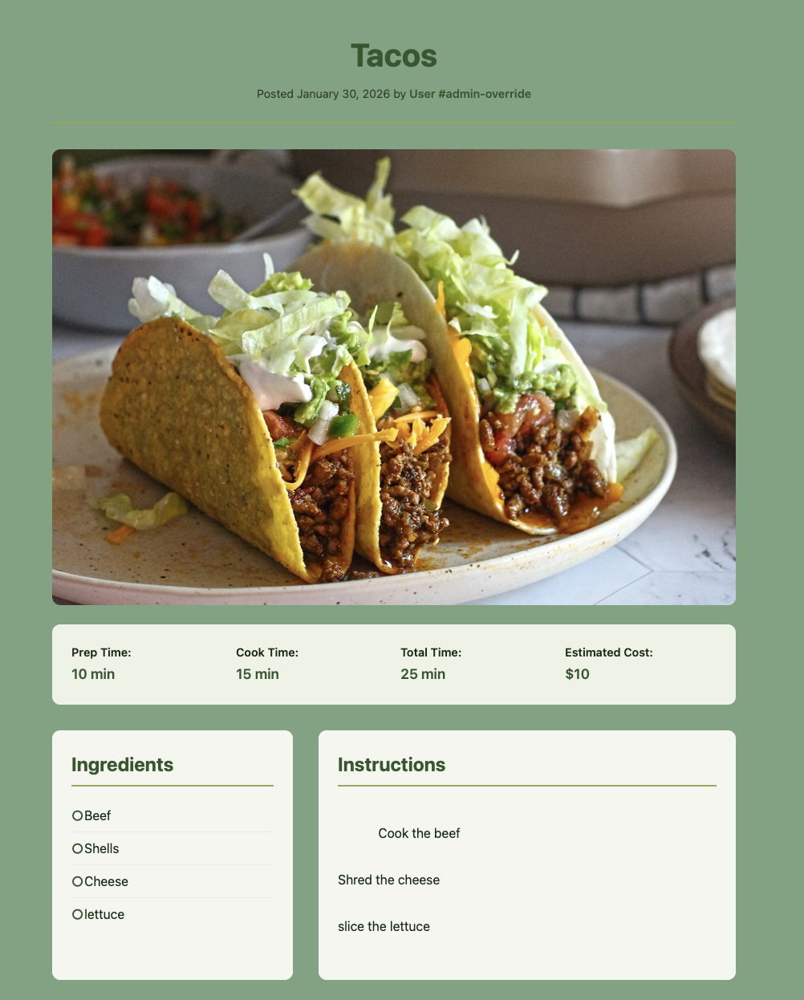

## Screenshots
    Here is a link to all the photos used in this guide.
[View Documentation Folder](./assets/images/userGuide)

